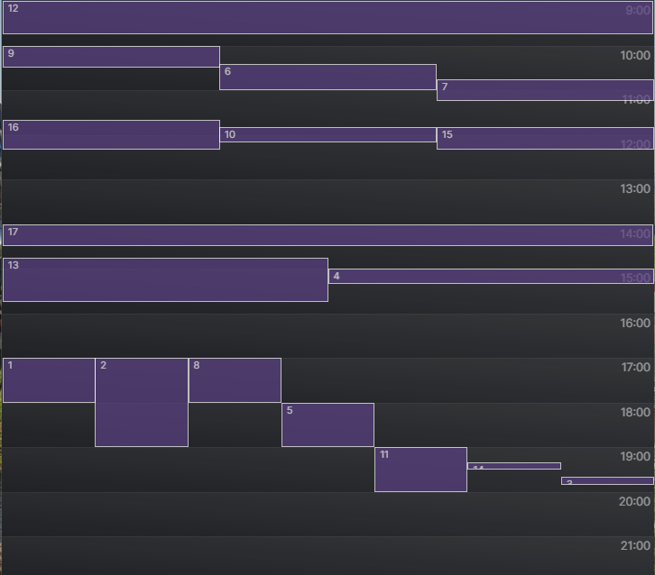

## Welcome to this Calendar app 👋



## Table of Contents

- #### [Intro](#introduction)

- #### [General Features](#features)

- #### [Usage.md](./frontend_senior/src/Usage.md)

- #### [Online deploy](https://calendar-app-test.netlify.app/)

---

## [Introduction]

In this web app you'll find a site that shows a timetable that shows a list of events chronollogically ordered. Whenever two of these events overlap in their time duration thei are equally devided

---

## [Features]

The app is based off a mock data foun in [src/data/input.json](https://github.com/lostmart/test_recrutement-fr_senior/blob/master/frontend_senior/src/data/input.json) and it shows all events listed chronollogically.

---

## [🔝](#table-of-contents)

## Repository Structure:

inside the `src` folder you'll find:

```
    ├── components              # (EventConotainer & HourContainer)
    ├── data                    # Mock data file
    ├── services                # Dirrerent helper functions
    ├── Styles                  # scss files
         ├── abstracts          # ( _colors.scss & _variables.scss )
         ├── base               # ( _reset.scss & _typography.scss )
         ├── layout             # ( _container.scss & _hourContainer.scss )
    ├── Usage.md               # Documentation that complements docsJs
    └── App.js
    └── index.js
```
